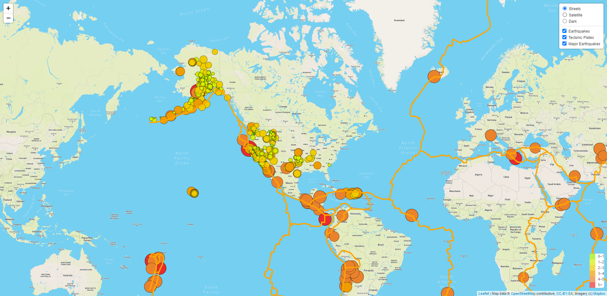
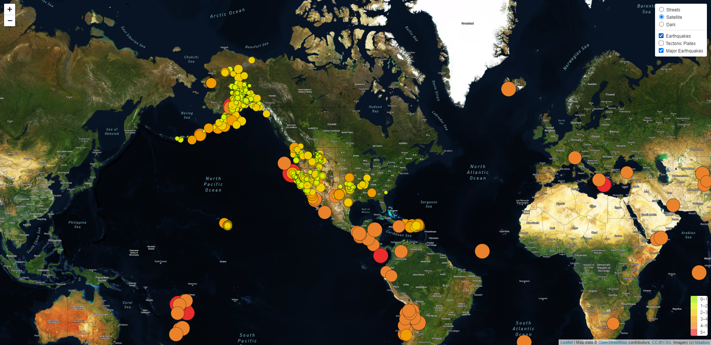
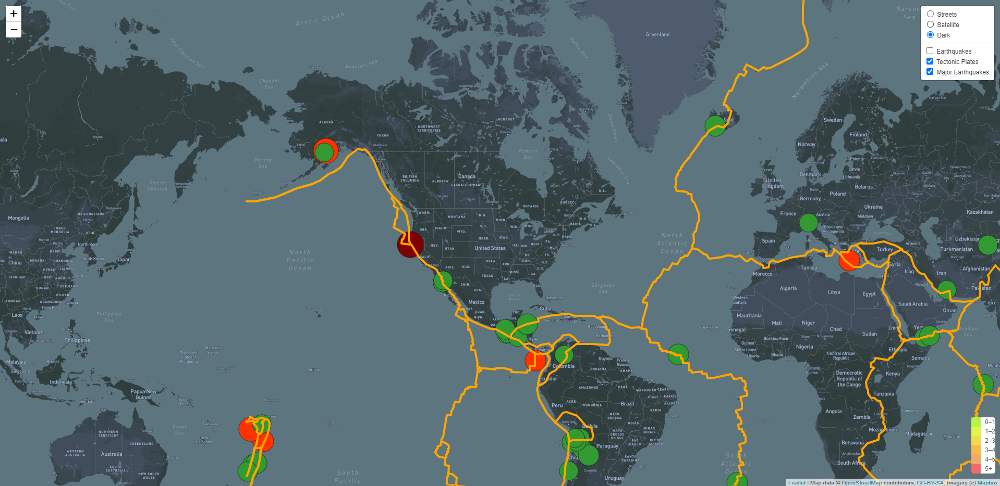

# Mapping_Earthquakes
## Objective
The objective of this challenge was to develop a layered map using GeoJSON data from publicly available United States Geological Society (USGS) earthquake data via their API to develop dynamic world maps that present information on earthquakes occurring in the past seven days, along with world tectonic plate boundaries, and a set of major (magnitude 4.5 or greater) earthquakes as well.

## Results
Well, I tried to go ahead and deploy the website  here: https://chris-bly.github.io/Mapping_Earthquakes, but the API key issue has me stuck for the time being.

The following images demonstrate the interactive maps showing the different views and layers:

**Street View with All Layers Visible**

**Satellite View with Earthquakes Visible**

**Dark Navigation View with Major Earthquakes and Tectonic Plate Borders Visible**

